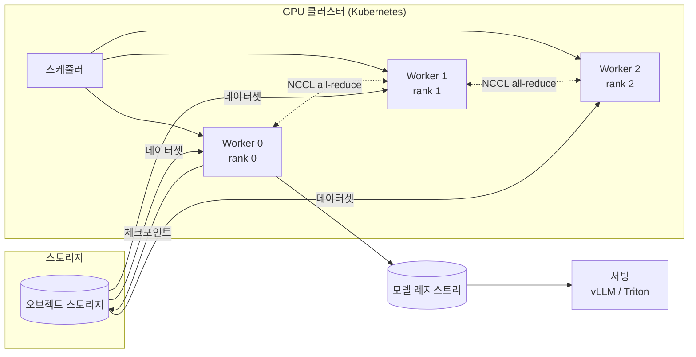
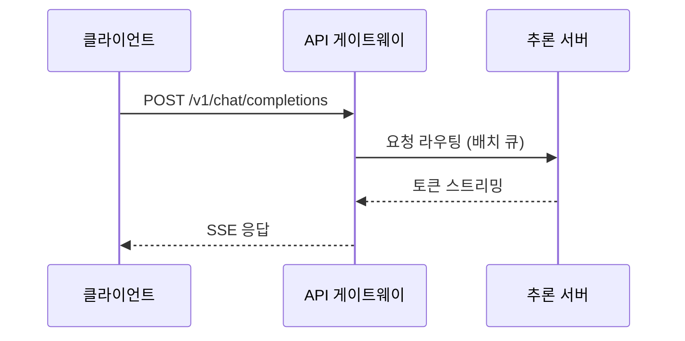

AI 인프라를 공부하면서 배운 것들을 정리하려고 블로그를 만들었다. 첫 글은 렌더링 테스트를 겸한다. 코드 블록, 다이어그램, 수식이 모두 잘 나오는지 확인해 보자.

## 코드 블록

PyTorch 분산 학습에서 가장 기본이 되는 `all_reduce` 예제다. 각 랭크가 가진 텐서를 합산해서 모든 랭크가 같은 결과를 갖게 한다.

```python
import os
import torch
import torch.distributed as dist


def main() -> None:
    dist.init_process_group(backend="nccl")
    rank = dist.get_rank()
    local_rank = int(os.environ["LOCAL_RANK"])
    torch.cuda.set_device(local_rank)

    # 각 랭크가 자기 rank 값으로 채운 텐서를 만든다
    x = torch.full((4,), float(rank), device="cuda")
    dist.all_reduce(x, op=dist.ReduceOp.SUM)

    # world_size 가 4 라면 모든 랭크에서 [6, 6, 6, 6] 이 출력된다
    print(f"[rank {rank}] {x.tolist()}")
    dist.destroy_process_group()


if __name__ == "__main__":
    main()
```

실행은 `torchrun` 으로 한다.

```bash
torchrun --nproc_per_node=4 all_reduce_demo.py
```

Kubernetes 매니페스트도 하이라이팅이 되는지 보자.

```yaml
apiVersion: v1
kind: Pod
metadata:
  name: gpu-smoke-test
spec:
  restartPolicy: Never
  containers:
    - name: cuda
      image: nvidia/cuda:12.4.1-base-ubuntu22.04
      command: ["nvidia-smi"]
      resources:
        limits:
          nvidia.com/gpu: 1
```

## Mermaid 다이어그램

학습 파이프라인을 대략 그려 보면 이렇다. 다크 모드로 바꾸면 다이어그램 테마도 함께 바뀐다.



시퀀스 다이어그램도 하나.



## 수식

Transformer의 스케일드 닷-프로덕트 어텐션은 다음과 같다.

$$
\operatorname{Attention}(Q, K, V) = \operatorname{softmax}\!\left(\frac{QK^{\top}}{\sqrt{d_k}}\right) V
$$

파라미터 수 $N$, 학습 토큰 수 $D$ 인 모델을 학습하는 데 드는 연산량은 대략 $C \approx 6ND$ FLOPs 로 근사할 수 있다. 예를 들어 $N = 7 \times 10^{9}$, $D = 2 \times 10^{12}$ 이면

$$
C \approx 6 \times 7 \times 10^{9} \times 2 \times 10^{12} = 8.4 \times 10^{22} \ \text{FLOPs}
$$

가 된다. 인라인 수식은 \(\sqrt{d_k}\) 처럼 `\( \)` 문법으로도 쓸 수 있다.

Chinchilla 스케일링 법칙에서 손실은 다음처럼 모델링된다.

$$
L(N, D) = E + \frac{A}{N^{\alpha}} + \frac{B}{D^{\beta}}
$$

## 인용과 표

> 인프라는 잘 돌아갈 때는 아무도 신경 쓰지 않고, 안 돌아갈 때는 모두가 신경 쓴다.

| 항목 | H100 SXM | A100 SXM |
|------|---------:|---------:|
| FP16 Tensor (dense) | ~989 TFLOPS | ~312 TFLOPS |
| HBM 용량 | 80 GB | 80 GB |
| HBM 대역폭 | 3.35 TB/s | 2.0 TB/s |
| NVLink | 900 GB/s | 600 GB/s |

여기까지 잘 보인다면 렌더링 설정은 끝난 것이다.
